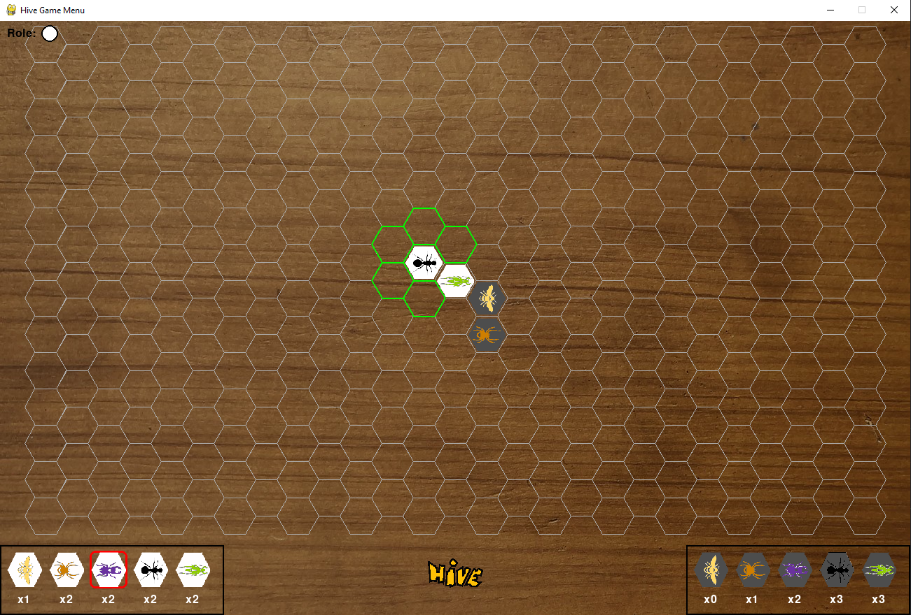
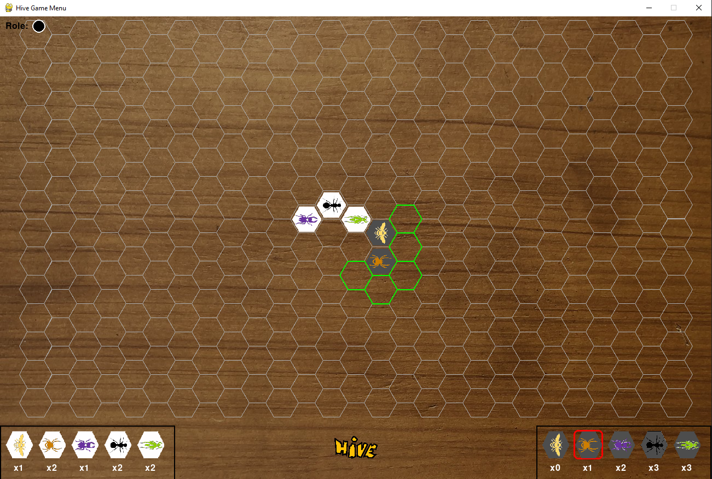

  <h1> AI Hive Board Game</h1>
  
  
  
  
  

  
  <h3>  This is a digital version of the Hive board game implemented in Python using Pygame. The game supports different modes including Player vs Player, AI vs Player, and AI vs AI.</h3>
  

## :star2: About The Project

### Game Modes

- **Player vs Player:** Two players can play against each other on the same machine.
- **AI vs Player:** Play against the computer. You can select the difficulty level for the AI.
- **AI vs AI:** Watch two AI players compete against each other. You can set different difficulty levels for each AI.

### Controls

- **Mouse Click:** Select pieces from the inventory or the board, and make moves.
- **Spacebar:** Skip turn when no legal moves are available.

### AI Difficulty Levels

- **Easy:** The AI makes basic moves with minimal strategy.
- **Medium:** The AI uses a moderate level of strategy.
- **Hard:** The AI employs advanced strategies and heuristics to make the best possible moves.

## 📈 Diagrams

### Class Diagram:

```mermaid
classDiagram
    class Hex {
        +int q
        +int r
        +int s
        +Hex(q, r)
        +distance(other: Hex): int
        +generate_adj_hexs(): list Hex
        +generate_directions(): list Hex
    }

    class Piece {
        +string piece_name
        +string piece_type
        +Hex hex
        +bool is_placed
        +get_image()
        +get_legal_moves(hex: Hex, board: list list Piece): list Hex
    }

    class Queen {
        +Queen(piece_type)
        +get_image()
    }

    class Spider {
        +Spider(piece_type)
        +get_image()
    }

    class Ant {
        +Ant(piece_type)
        +get_image()
    }

    class Hopper {
        +Hopper(piece_type)
        +get_image()
    }

    class Beetle {
        +Beetle(piece_type)
        +get_image()
    }

    class Main {
        +main()
        +run_game_loop()
    }

    class Board {
        +dict board
        +Board(grid_radius: int)
        +place_piece(target_hex: Hex, piece: Piece)
        +remove_piece_by_hex(hex: Hex): Piece
        +hex_empty(hex: Hex): bool
        +remove_top_piece(hex: Hex): Piece
        +peek_top_piece(hex: Hex): Piece
        +pieces_count(hex: Hex): int
        +possible_inserts(role_type: string, turn: int): list Hex
        +possible_moves(hex: Hex, role_type: string): list Hex
        +get_queen_location(role_type: string): Hex
        +is_endgame(role_type: string): bool
        +can_slide(from_hex: Hex, to_hex: Hex): bool
    }

    class HiveBoard {
        +window
        +layout
        +_hexes
        +piece_images
        +scaling_factor
        +scale_width
        +hex_to_pixel(h: Hex): Point
        +hex_corner_offset(corner: int): Point
        +polygon_corners(h: Hex): list Point
        +draw_hex(hex: Hex, color: tuple, width: int): Rect
        +draw_pieces(board: Board)
        +draw_suggested_moves(moves: list Hex)
        +draw(board: Board, suggested_moves: list Hex)
        +handle_click(pos: tuple): Hex
    }

    class Item {
        +string type
        +string name
        +int count
        +image
        +Rect rect
        +bool selected
        +set_position(x: int, y:int)
        +draw()
    }

    class Inventory {
        +int x
        +int y
        +list items
        +string role
        +add_item(item: Item)
        +draw()
        +handle_click(pos: tuple): Item
        +select(selected_item: Item)
        +reset_selected()
        +get_item_by_name(name: string): Item
    }

    class HiveGameOver {
        +show_endgame_screen(result: string)
        +handle_endgame_input(): bool
    }

    class HiveMenu {
        +int screen_width
        +int screen_height
        +Color WHITE
        +Color BLACK
        +Color GRAY
        +Color HOVER_COLOR
        +Font font
        +Font small_font
        +image background
        +list menu_options
        +list ai_difficulties
        +dict game_config
        +draw_text(text, font, color, x, y)
        +main_menu()
        +difficulty_menu(mode)
    }

    class Node {
        +Board board
        +list white_inventory
        +list black_inventory
        +int turn
        +is_role_white(): bool
        +get_type_from_turn(): string
        +get_inventory_from_turn(): list Item
        +_create_piece(piece_type, role): Piece
        +apply_move(from_hex: Hex, to_hex: Hex, from_inventory_piece_name: string, undo_stack: list): void
        +undo_move(undo_stack: list): void
    }

    class HiveMinMaxAI {
        +string role
        +string difficulty
        +int max_depth
        +choose_best_move(board: Board, turn: int, white_inventory: list, black_inventory: list): dict
        +_minmax(node: Node, depth, is_maximizing, alpha, beta, undo_stack): int
        +_generate_all_moves(node: Node): list dict
        +_evaluate_board(node: Node): int
        +_calculate_piece_mobility(board: Board, role, mobility_weights): int
        +_evaluate_queen_safety(board: Board, role): int
    }

    class HiveGame {
        +dict game_config
        +HiveMinMaxAI white_ai
        +HiveMinMaxAI black_ai
        +Clock clock
        +HiveBoard hive_board
        +Board board
        +Item selected_outside_item
        +Hex selected_piece_hex
        +list possible_moves
        +string game_mode
        +string current_player
        +Inventory white_inventory
        +Inventory black_inventory
        +int turn
        +int white_skip_counter
        +int black_skip_counter
        +is_role_white(): bool
        +setup_inventories()
        +handle_events(): bool
        +get_piece_from_item(item: Item): Item
        +get_type_from_turn(): string
        +update_display()
        +run_game(): string
        +end_game_result(): string
        +perform_ai_move(ai_player: HiveMinMaxAI)
        +_is_turn_skippable_helper(turn: int): bool
        +is_turn_skippable(turn:int): bool
        +display_skip_screen()
    }

    Piece <|-- Queen
    Piece <|-- Spider
    Piece <|-- Ant
    Piece <|-- Hopper
    Piece <|-- Beetle
    Board o-- "many" Hex
    Board "1" -- "many" Piece
    HiveGame o-- HiveMinMaxAI
    HiveGame o-- HiveBoard
    HiveGame o-- Board
    HiveGame o-- Inventory
    Inventory "1" -- "many" Item
    HiveBoard o-- Hex
    Node o-- Board
    Node o-- Item
    HiveMinMaxAI o-- Node
    Main -- HiveGame
    Main -- HiveMenu
    Main -- HiveGameOver
```

### Sequence Diagram:

### State Diagram:

## 🧰 Example

## 👩‍💻 Possible Improvements
- Add Multiplier mode Game (Create a backend end and use websocket to communicate between the different players)
- Increase the AI thinking by thinking how to implement topics like genetic algorithms, reinforcement learning, neural networks.